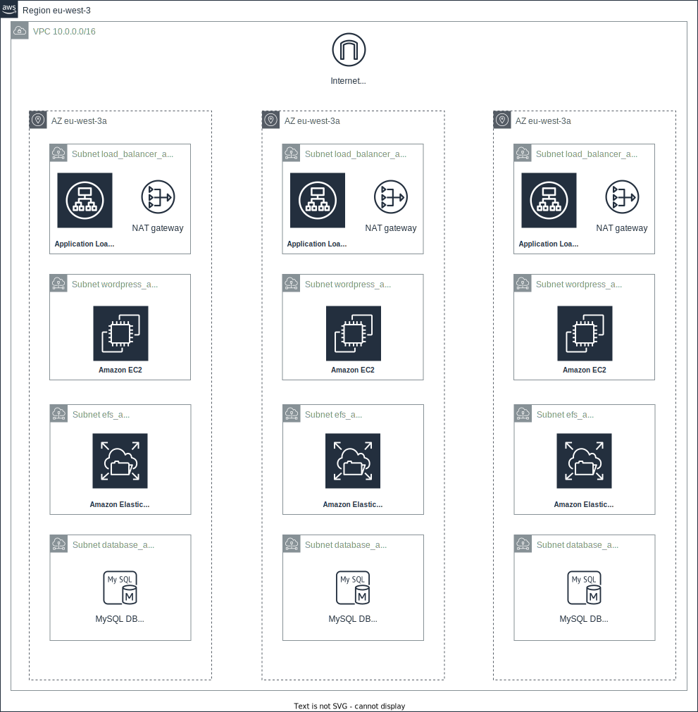

# Progetto Wordpress

## Architettura

- **Application Load Balancer**: gestiscono il traffico HTTP in ingresso. Ogni qualvolta un utente si connette al sito, uno dei Load Balancer riceve la richiesta e la rigira ad una istanza Wordpress. Dall'esterno è possibile raggiungere solo i Load Balancer sia perchè sono ospitate nelle uniche subnet dotate di indirizzo IP pubblico, sia perchè sono le uniche ad avere il firewall impostato per accettare dati dall'esterno.
- **Nat Gateway**: permettono alle istanze Wordpress di connettersi a internet per installare aggiornamenti, pacchetti e altri dati necessari a poter funzionare.
- **Istanze Wordpress**: istanze che ospitano il sito Wordpress. Il firewall è configurato in modo che solo i Load Balancer possono richiedere le pagine del sito. Grazie al sistema di Auto Scaling, il numero di istanze aumenta e diminuisce in base al carico medio della CPU, impostato al 70%.
- **EFS**: contengono i dati del sito, condiviso fra tutte le istanze Wordpress. Il firewall è configurato in modo che solo le istanze Wordpress possono leggere i dati del sito.
- **MySQL**: istanze del database configurato in Multizona con una zona secondaria. Il firewall è configurato in modo che solo le istanze Wordpress possano accedere al database.

## Installazione

1. Assicurarsi di modificare il file *providers.tf* fornendo le opportune *shared_credentials_files* e *profile*
2. `terraform init`
3. `terraform apply` per lanciare il sistema con i valori di default presenti in *variables.tf* eccetto che per la password del database che dovrà essere inserita manualmente. Se invece si vogliono definire le variabili, è possibile aggiungere un file *variables.tfvars* dove definire i valori diversi da quelli di default, ad esempio *wp_version* per stabilire la versione di Wordpress contenuto nelle istanze, e lanciare `terraform apply -var-file="variables.tfvars"`
4. Al termine della creazione, verrà restituito l'indirizzo al quale connettersi per vedere il sito. Aprire il browser all'indirizzo presente in *wp_loadbalancer_address*. **Attenzione**: potrebbe restituire "502 Bad gateway" inizialmente. Attendere ancora qualche minuto (per il primo deploy possono volercene circa 10).
5. `terraform destroy` per distruggere le macchine.

**Attenzione**: per avere HTTPS abilitato, si assume che sia già stato richiesto il certificato ACM. È necessario decommentare in "ec2.tf" il listener HTTPS e definire la variabile "arn_acm_certificate".

## Assunzioni

Non essendomi stati forniti nè i file SQL, nè i codici del sito, si assume che il cliente sia interessato al deploy ex novo di Wordpress e che configurerà l'applicativo dall'interfaccia web. Di conseguenza, nelle prime fasi di vita il sito non richiederà grandi risorse. Si è perciò deciso di usare come impostazioni di default istanze del database e di EC2 delle famiglie rispettivamente db.t3 e t2. È possibile cambiare in *variables.tf* la potenza delle macchine.
